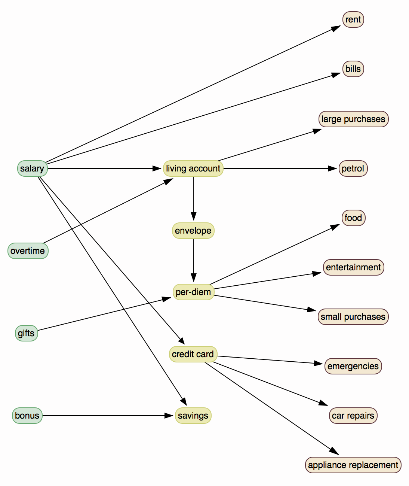

# Envelope Per-Diem Budget

A set of rules and helper scripts to simplify the maintenance of a per-diem envelope budget.

- Low overheads
- Minimise impulsive purchases
- Mindful spending
- Avoid missing out or breaking budget due to lack of planning or unforeseeable circumstances.
- Easy to restart if you make a mistake.
- You don't have to wait to the start of the month to be begin.

Parcelling myself out cash on a daily basis makes it easy to not inadvertently overspend on the little things. However, it is impossible for me to pay for the irregular, costly things like a tank full of petrol, a new pair of shoes or a friends birthday dinner.

With better planning at the start of each month, I hope that this tool will make it easy.


## Getting Started

1. Checkout this code base. `git clone ...`

2. Fill out `./settings.yml` with suitable values to you.

    ``` Yaml
    ---
    pay_day: 15               # The day of the month which you are paid
    bonus_multiplier: 2       # Weekend bonus ( value is n * per-diem )
    per_diem: 30              # Your per-diem cash rate
    buffer_multiplier: 0.10   # Buffer to cover the irregular things. (0.10 == 10%)
    ```

3. See how you are going. `./bin/epd-budget <bank_balance> <cash_balance>`

    ```ShellSession
    # BALANCE
    Bank Balance:       $ 212.0
    Cash Balance:       $ 21.22
    Net Balance:        $ 233.22

    # POSITION
    Break Even:         $ 21.2
    Surplus:            $ -189.78
    Runway:             7 days (2016-09-09)
    Next Payday:        11 days (2016-09-15)

    # PER-DIEM
    Today:              $30
    Tomorrow:           $30
    ```

4. Make any adjustments or transfers so that you won't run out of money by the end of the month (as indicated by the `Surplus` value).

5. Go to the bank and withdraw a weeks worth of cash then put it in an envelope.

6. Take today's per-diem from the envelope and put it in your wallet.

For the majority of the month, all you need to do is make sure that your envelope is topped up and you have taken your per-diem.

---




## Budget Rules

Credit Card
Savings Account
Working Account
Envelope
Cash

Bank Account Stuff:
1. A bank account to hold your


1. All living costs are to come from per-diem:

    - Food
    - Fuel
    - Entertainment
    - Consumables
    - Small purchases (books, music, clothing)
    - Large purchases (furniture, toys, gadgets)


1. Any ongoing recurring commitments are considered bills. As they cannot be manipulated by mindful spending, they are excluded:

    - Rent
    - Electricity
    - Internet
    - Telephone


3. Emergencies do not need to come from per-diem:

    - Medical treatment
    - Car repairs
    - Appliance replacement


4. Additional, unplanned income goes into your days per-diem:

    - Overtime
    - Sale of items
    - Gifts

---

## How it works

At the start of the month, you pay your bills, determine how much you need to live off for the month, then put the rest into a savings account.

For each day, you give yourself a per-diem.

Every Friday, you give yourself a weekend bonus to make sure you have enough money to have some fun.


## Values

- Per-Diem Buffer: Amount of money per day that is put aside for the big irregular things like fuel.
- Per-Diem Cash: How much money you doll out to yourself each day.
- Weekend Bonus: Extra cash to make the weekend that little bit more fun.
